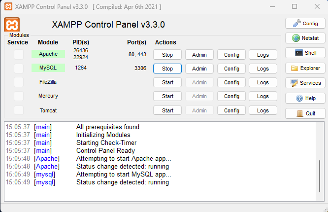

# Projet Symfony

## Thème choisi

Les données porteront sur le thème de la musique, en suivant les associations décrites dans la partie suivant. Le thème est évidemment inspiré de spotify.

## Entité-relation

## Barème

### Entité principale

L'entité principale est ALBUM
- Ele possège un champ de type enum pour le statut de l'album
- OneToMany : Un ALBUM a pleins de MUSIC
- OneToOne : Un ALBUM a seulement une COVER
- ManyToOne : Un ALBUM est créer par un ARTIST, mais un ARTIST peut créer plusieurs ALBUM
- ManyToMany : Tout les ALBUMS peuvent être likés par plusieurs d'UTILISATEUR

Les entités enfants sont MUSIC, ARTIST, STYLE, COVER, UTILISATEUR
- OneToMany : Une MUSIC a un STYLE, plusieurs MUSIC peuvent être du même style

### Fixtures

Un jeu de fixtures simple sur l'artiste XXXTentacion est disponible.

### Système de traduction

Le site est disponible en anglais et en francais grâce au package translation.

### Formulaires

Des formulaires sont disponibles pour chaque entité. Ils sont accessibles seulement par les utilisateurs.

### Système de connexion

Le site dispose d'un système de connexion et d'inscription grâce au package security.

### Un tableau de bord

La page d'accueil affiche les statistiques sur la disponibilités des albums, et les albums les plus récent.

### Gestion d'Évènement

## Installation

La première étape consiste a installer XAMPP, afin d'avoir un serveur WAMP, (bon je vais pas détailler ca quand même).

