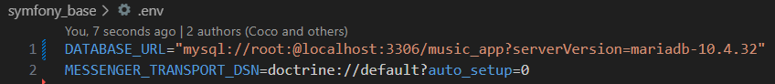

# Projet Symfony

## Thème choisi

Les données porteront sur le thème de la musique, en suivant les associations décrites dans la partie suivant. Le thème est évidemment inspiré de spotify.

## Entité-relation

Schéma de la base de données.

(Il manque quelques trucs, mais c'est plus ou moins ca)


## Barème

### Entité principale

L'entité principale est ALBUM
- Ele possège un champ de type enum pour le statut de l'album
- OneToMany : Un ALBUM a pleins de MUSIC
- OneToOne : Un ALBUM a seulement une COVER
- ManyToOne : Un ALBUM est créer par un ARTIST, mais un ARTIST peut créer plusieurs ALBUM
- ManyToMany : Tout les ALBUMS peuvent être likés par plusieurs d'UTILISATEUR

Les entités enfants sont MUSIC, ARTIST, STYLE, COVER, UTILISATEUR
- OneToMany : Une MUSIC a un STYLE, plusieurs MUSIC peuvent être du même style

### Fixtures

Un jeu de fixtures simple sur l'artiste XXXTentacion est disponible.

### Système de traduction

Le site est disponible en anglais et en francais grâce au package translation.

### Formulaires

Des formulaires sont disponibles pour chaque entité. Ils sont accessibles seulement par les utilisateurs.

### Système de connexion

Le site dispose d'un système de connexion et d'inscription grâce au package security.

### Un tableau de bord

La page d'accueil affiche les statistiques sur la disponibilités des albums, et les albums les plus récent.

### Gestion d'Évènement

Il y a un listener sur l'event du login d'un client. Lorsqu'un client so connecte, un booléen appellé "isSend" dans la base de données passe a "True".

## Installation

Tout d'abord, on installe xampp et composer:

XAMPP : [https://www.apachefriends.org/fr/index.html](https://www.apachefriends.org/fr/index.html)
</br>
COMPOSER : [https://getcomposer.org/download/](https://getcomposer.org/download/)

Un fois xampp installé et lancé, on lance le serveur apache et mysql :


Ensuite, on clone le projet dans le dossier htdocs de xampp. 
</br>
Il se trouve dans le répertoire d'installation de xampp sous : `xampp/htdocs`

```
$ git clone https://github.com/Mirecos/symfony_base
```
On peut maintenant installer les dépendances grâce a :
```
$ composer install
```
Enfin, on crée un fichier '.env' dans lequel on saisi le lien de notre database. 
Les détails peuvent différer selon les identifiants de connexions a mysql et la base de donnée que l'on veut utiliser :

```
DATABASE_URL="mysql://<username>:<password>@localhost:3306/<dbName>?serverVersion=mariadb-10.4.32"
MESSENGER_TRANSPORT_DSN=doctrine://default?auto_setup=0
```
L'URL de la DB peut être ajusté selon la version en local.



Enfin on exécute les commandes suivantes dans le terminal a l'emplacement du projet :
```
$ php bin/console d:d:c
$ php bin/console doctrine:migrations:diff
$ php bin/console doctrine:migrations:migrate 
$ php bin/console doctrine:fixtures:load
```

Finalement, on observe notre site sur navigateur via le lien :

```
http://localhost/symfony_base/public/en/home
```